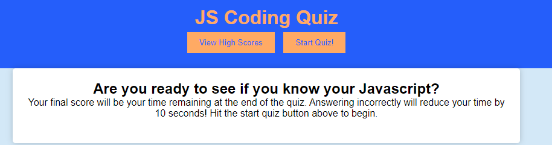

# js-coding-quiz
Timed coding quiz with multiple choice questions created using HTML, Javascript and CSS

## Summary
This quiz has multiple choice questions related to Javascript. When you start the quiz a timer begins running. When you answer a question incorrectly it will subtract time remaining. Your score is based off of your time remaining, so answering incorrectly or taking time to research the question will reduce your score! Once you have completed the quiz you can submit your score to the leader board and view other high scores.

## Screenshot

## Author: Mike Engstrand
https://github.com/mikeengstrand/js-coding-quiz
